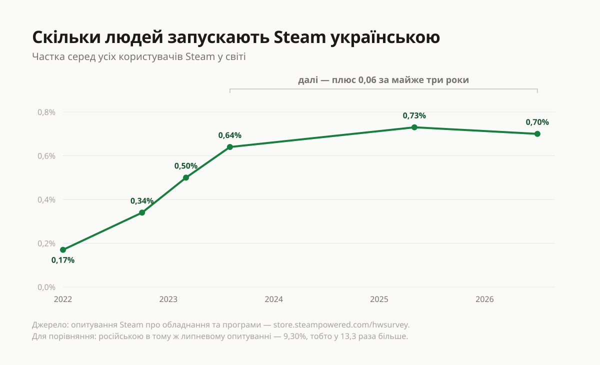
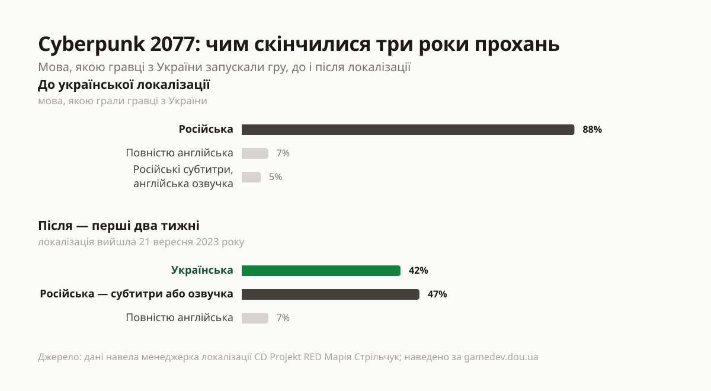
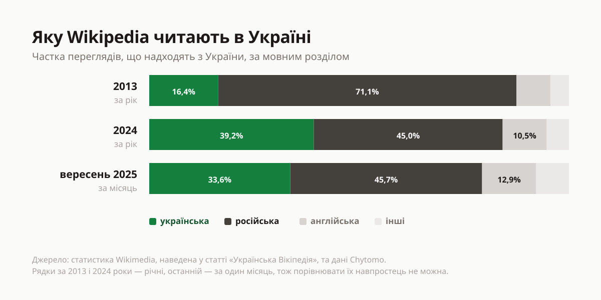
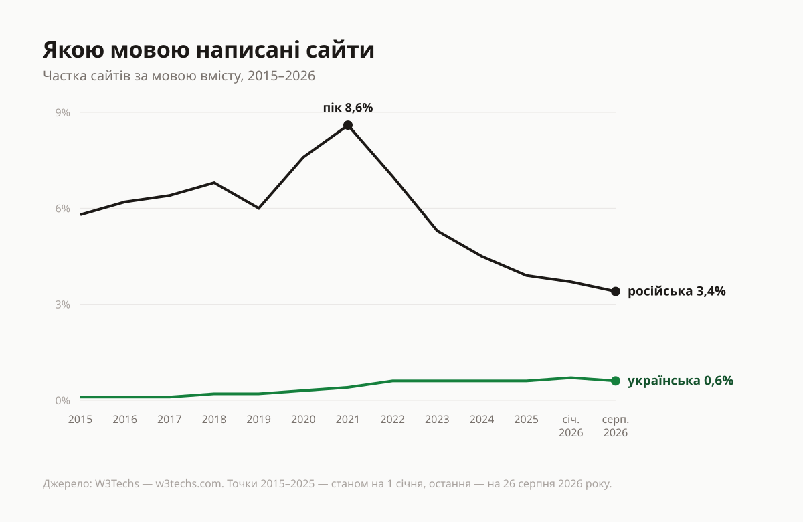
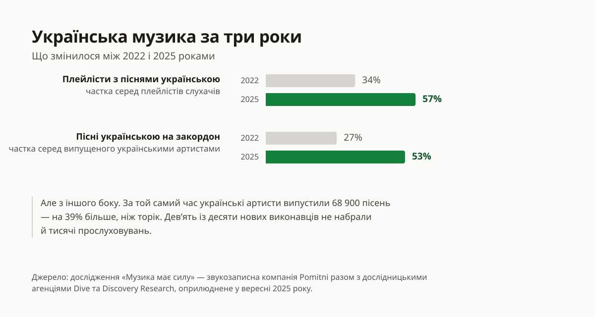

21 вересня 2023 року в грі Cyberpunk 2077 нарешті зʼявилася українська.
Спільнота просила про це три роки поспіль: писали розробникам, збирали підписи,
доводили, що аудиторія є. Польська студія CD Projekt RED зрештою замовила
переклад українській компанії UnlocTeam.

А далі сталося найцікавіше.

Локалізація — це коли гру чи програму перекладають вашою мовою: меню, підказки,
репліки героїв. Марія Стрільчук, яка відповідає за неї в CD Projekt RED, згодом
[розповіла](https://gamedev.dou.ua/forums/topic/47022/), що показали заміри. До
того, як гра заговорила українською, 88 зі 100 гравців з України грали в неї
російською. За перші два тижні після — українську ввімкнули 42 зі 100. А 47 зі
100 лишилися на російській.

Ось, власне, вся стаття в одному прикладі. Переклад зробили. А далі його доля
залежала від того, що показав лічильник.

Нижче — числа, які публікують самі платформи: з датами й посиланнями, щоб кожне
можна було відкрити й перерахувати. Разом із тими, що нашому ж аргументу
невигідні: вони теж тут, бо текст, який друкує самі лише приємні цифри, не має
права просити довіри.

## Що саме рахують

Мова, яку ви собі виставили, здається приватною справою — щось на кшталт
розміру шрифту. Насправді вона майже одразу перетворюється на число в чужій
таблиці. Чотирма різними способами.

**Список мов, який надсилає ваш браузер.** Коли ви відкриваєте будь-яку
сторінку, браузер разом із запитом передає сайту перелік мов, якими ви готові
читати, — у тому порядку, який ви виставили. Сайт бачить цей перелік ще до
того, як покаже вам бодай слово.

**Мова, якою запущено програму.** Кожна програма знає, якою мовою її відкрили,
і вміє порахувати, скільки в неї таких користувачів.

**Сторінка, яку ви обрали.** Тут навіть налаштування не потрібне. У Wikipedia
кожна мова — окремий сайт зі своїми статтями; щойно ви з двох варіантів
клацнули український, це вже рядок у статистиці.

**Що ви додивилися й дослухали.** Алгоритми, які добирають, що показати вам
наступним, зважають не на те, що ви заявили, а на те, що ви справді відкрили й
не закрили.

Перші два — це те, що ви налаштували. Другі два — те, що ви зробили. Далі буде
і про перші, і про другі, бо поводяться вони по-різному.

І головне, що варто зрозуміти одразу: рядка «не визначився» в цих таблицях
немає. Ви обовʼязково опинитеся в якомусь стовпчику — української, російської
або англійської. Нічого не міняти — теж відповідь: тоді вас порахують там, куди
поставило заводське налаштування. Англійська тут повноцінний третій варіант, а
не «нейтральна» відсутність вибору: якщо ви тримаєте її скрізь, ваш голос
дістанеться саме їй. Це ще буде видно нижче — і у Wikipedia, і в усьому вебі
місце, яке звільняє російська, дістається насамперед англійській, а не
українській.

## Steam: таблиця, яку видно всім

Steam — найбільший у світі магазин компʼютерних ігор: через нього ігри купують і
через нього ж запускають. Належить він американській компанії Valve.

Цей приклад зручний тим, що видно весь ланцюжок. Мову обирає користувач. Valve
щомісяця публікує [зведення](https://store.steampowered.com/hwsurvey) про те,
хто якою мовою користується. І сама ж пояснює, навіщо його збирає:

> Steam щомісяця проводить опитування, щоб зібрати дані про те, яким
> компʼютерним обладнанням і програмним забезпеченням користуються наші клієнти.
> Зібрана інформація надзвичайно допомагає нам ухвалювати рішення про те, у які
> технології інвестувати і які продукти пропонувати.

Тут варто бути точними: Valve каже це про власні рішення, а не за видавців
ігор. Але таблиця відкрита, а іншої такої просто немає — більше ніде не
подивитися, скільки людей у світі запускають ігри якою мовою. Тож коли хтось
прикидає, чи окупиться українська локалізація, дивитися він буде сюди.

_Частка людей, які запускають Steam українською. Відстані по горизонталі — справжні: перші чотири заміри вклалися у девʼятнадцять місяців, останні три розтягнуті майже на три роки._

Придивіться до форми лінії. Спершу вона за півтора року виростає вчетверо — з
0,17% до 0,64%. Жодного закону, жодної квоти, жодної державної програми: сама
лише сума людей, які відкрили налаштування й змінили один рядок.

А потім розгін закінчується. За наступні майже три роки лінія додає 0,06 —
після 0,47 за попередні девʼятнадцять місяців. Для порівняння: російською в тому
ж липневому опитуванні — 9,30%, тобто у 13,3 раза більше.

Одне уточнення, щоб не перебільшити. Опитують не всіх: Valve щомісяця питає
частину користувачів, і відповідати ніхто не зобовʼязаний. Ваша програма не
обовʼязково потрапить у вибірку цього місяця. Але частка, яку показує таблиця,
— це частка людей, які поставили собі саме цю мову.

## Опитування — це не лічильник

У травні 2024-го Едмунд Макміллен, автор гри Mewgenics, запитав у себе в
соцмережі, яку локалізацію робити наступною. Українська виграла: 63,3% із
24 385 голосів, перше місце з чотирьох варіантів.

Наступною зробили російську.

Пояснюючи вибір, Макміллен показав іншу табличку — скільки разів гру додали до
списку бажань у Steam, з розбивкою по країнах. Росія була там другою після США.
України не було й у першій вісімці.

Різниця між цими двома числами і є те, про що вся ця стаття. Проголосувати —
безкоштовно, швидко й ні до чого не зобовʼязує; ті 24 тисячі голосів не
потрапляють у жоден звіт, окрім самого опитування. Додати гру до списку бажань —
це дія, яку платформа рахує сама й показує розробнику поруч з усіма іншими
країнами. Виграло не те число, яке було більшим, а те, яке рахують.

Із цього не варто робити висновок про конкретну студію — варто зробити висновок
про себе. Захотіти українською й сказати про це вголос — це одне число. Зробити
так, щоб це побачив лічильник, — інше.

І це не лише про закордонні студії.

MacPaw — київська компанія, авторка CleanMyMac. У січні 2022-го її сайт
macpaw.com виходив 13 мовами: англійською, німецькою, іспанською,
французькою, італійською, японською, корейською, нідерландською, польською,
португальською, шведською, норвезькою — і російською. Української серед них не
було. Сама програма українську на той час уже мала — а сайт компанії ні.

Сьогодні там навпаки: українська локаль є, російської немає.

Шукати тут злий намір не варто, і ми його не приписуємо. Сайт перекладають
туди, звідки приходять покупці, і ця арифметика в київській компанії така сама,
як у польській чи американській. Саме тому приклад показовий: річ не в тім, що
комусь до вас байдуже, а в тім, що рішення ухвалюють за таблицею. Таблиця
змінилася — змінився й сайт.

## Що показує приклад Cyberpunk 2077

Повернімося до чисел із початку — їх варто побачити повністю.

_Мова, якою гравці з України запускали Cyberpunk 2077, до і після появи української. Рахували тих, хто зайшов у гру хоча б раз протягом двох тижнів після виходу великого доповнення Phantom Liberty._

42% — це багато. Майже половина тих, хто ще два тижні тому бачив у грі
російські написи, перемкнулася, щойно зʼявився вибір.

47% — це теж багато, і це число тепер живе своїм життям. Тільки не поспішаймо з
висновками про людей: у програмах мову майже ніколи не питають удруге. Гра
памʼятала те, що їй колись давно вказали, оновлення ні про що не перепитувало, а
новину «тепер є українська» побачили не всі. Мова, обрана багато років тому,
просто лишилася на місці.

Але таблиця цього не розрізняє. Наступного разу, коли інша студія рахуватиме, чи
варто замовляти українську, вона побачить приклад, у якому переклад оплатили — а
скористалася ним трохи менш ніж половина тих, для кого його робили.

А тим часом та сама студія зробила це вдруге. У серпні 2026-го на Gamescom
CD Projekt RED оголосила, що безкоштовний ремастер «Відьмака 3», який виходить
29 вересня 2026 року, вперше матиме офіційний український текст. Саме текст —
озвучення українською не буде.

І одразу про те, чого з цього не варто висновувати. Ніхто не казав, що причина —
цифри: студія пояснювала своє рішення власною політикою, а не чиїмись
таблицями. А скільки людей увімкнуть ту українську, поки не знає ніхто, бо на
момент цієї статті ремастер ще не вийшов. Це, власне, і робить його зручним:
наступний замір буде саме там, і перевірити його зможете ви самі.

Тим часом [каталог української локалізації ігор](https://kuli.com.ua/), який
веде та сама UnlocTeam, зараз налічує 3 337 офіційних перекладів, 82
напівофіційні й 987 аматорських. Через два місяці після запуску, у червні
2023-го, у ньому було «понад 1 500» ігор загалом.

І одразу застереження, без якого це число нечесне: каталог ріс не тільки тому,
що зʼявлялося більше перекладів, а й тому, що сам каталог ставав повнішим. І ще
одне, що варто знати. За підрахунками аналітичної служби GameSensor, **частка**
платних ігор з українською досягла піку у 2018–2019 роках і відтоді
зменшується, хоча самих таких ігор більшає. Ігор виходить більше, ніж встигають
перекладати.

## Wikipedia: вибір, для якого не треба налаштувань

Найчистіший приклад у цій статті. Тут нема чого налаштовувати — є лише питання,
на яке посилання людина клацнула. У Wikipedia кожна мова живе окремо: українська
стаття про Київ і російська стаття про Київ — це два різні тексти, які пишуть
різні люди.

_Частка переглядів Wikipedia, що надходять з України. Зверніть увагу на різну природу рядків: перші два — за цілий рік, останній — за один місяць._

У 2013-му російську версію відкривали в 4,3 раза частіше за українську. У
вересні 2025-го — в 1,36 раза. Розрив не зник, але за дванадцять років звузився
втричі, і зробили це люди, які просто почали клацати інше посилання.

Далі — те, що псує картинку. І сказати про це маємо ми самі. Українська частка
досягла максимуму близько 39% у 2023 році й відтоді сповзає вниз. Почасти це
«падіння» — через те, що річний показник і місячний порівнювати не можна. Але
почасти воно справжнє: зростала англійська. А ще Wikipedia загалом
втрачає читачів, відколи відповіді почали питати в чат-ботів — українській
версії за 2023 рік нарахували 1 188 млн переглядів, а за 2025-й уже 831 млн.
Якщо коротко і чесно: розрив звузився, а потім Wikipedia в цілому почала
меншати.

І окремо — про якість, а не про кількість. В українській Wikipedia
[1 432 459 статей](https://meta.wikimedia.org/wiki/List_of_Wikipedias), 14-те
місце у світі й третє серед словʼянських. У російській — 2 115 441. Але цікавіше
інше число: тих, хто регулярно пише статті, в українській 4 813, а в російській
16 558. Різниця — більш ніж утричі. Саме тому російська версія досі
докладніша майже з будь-якої теми, і саме тому цього не полагодити перемиканням
мови в меню. Автори беруться з читачів.

## Увесь веб: що насправді показують дванадцять років

W3Techs — служба, яка щодня обходить мільйони сайтів і рахує, якою мовою вони
написані. Ось [як це виглядає](https://w3techs.com/technologies/overview/content_language)
за дванадцять років:

_Частка сайтів за мовою, якою написано їхній вміст. Дані станом на 26 серпня 2026 року._

Найпомітніше тут — не українська лінія, а російська: 8,6% на піку в 2021 році й
3,4% у серпні 2026-го. Більш ніж удвічі менше за пʼять років.

Це легко прочитати як перемогу — і саме тому варто придивитися. Українська за ті
самі дванадцять років виросла з 0,1% до 0,6%, тобто вшестеро, але від 2022 року
стоїть на місці й коливається між 0,6% і 0,7%. Тобто російська впала — але не на
користь української. Звільнене місце дісталося іншим мовам, передусім
англійській. І станом на сьогодні російськомовних сайтів усе ще у 5,7 раза
більше, ніж україномовних.

Як саме рахують, щоб можна було перевірити: W3Techs обходить «значно понад 20
мільйонів» сайтів, які вважає змістовними — порожні сторінки-заглушки й копії
відкидає. Мову визначає для сайту загалом, а не для кожної сторінки окремо.

## Музика: число, яке рухалося найшвидше

Тут відстань між «що люди слухають» і «що музиканти випускають» скоротилася до
трьох років — і це добре видно.

_Дані [дослідження «Музика має силу»](https://suspilne.media/culture/1110886-ukrainska-muzika-nabirae-obertiv-castka-pisen-ukrainskou-v-plejlistah-zrosla-do-57/), яке провела звукозаписна компанія Pomitni разом з дослідницькими агенціями Dive та Discovery Research._

Музиканти відреагували швидко: з липня 2024-го до липня 2025-го українські
артисти випустили 68 900 пісень — на 39% більше, ніж за попередній рік.
Зʼявилося 439 нових виконавців.

І одразу число, яке варто тримати поруч: девʼять із десяти цих новачків не
набрали й тисячі прослуховувань. Пісень стало більше, а слухачів на них не
вистачило. Більше українського ще не означає, що його слухають: кількість і
увага — різні речі, і міряють їх окремо.

## Пошук і переклад: мова обирає ще й джерело

Досі йшлося про те, що ваша мова додає до чужої таблиці. Але вона робить і
дещо інше, помітне вже сьогодні: обирає, з чого вам складуть відповідь.

Пошук відповідає тією мовою, якою його спитали. Serpstat — київська компанія,
яка аналізує пошукову видачу, — звірила дві приблизно рівні вибірки по
2,5 мільйона запитів, українською й російською, з бази Google Україна: на запит
українською відповідь приходить українською у 90,8% випадків. Тобто мова запиту
— це не лише мова відповіді. Це ще й відбір джерел: питання, поставлене
російською, шукає відповідь у російськомовному корпусі. А він, як видно з
графіка вище, у 5,7 раза більший за україномовний.

У тому ж [аналізі](https://focus.ua/uk/opinions/764285-komu-naspravdi-doviryaye-shtuchniy-intelekt-google-v-ukrajini)
є число вже не про мову, а про самі джерела: у видачі, орієнтованій на Україну,
19,69% відповідей Google AI Overview — блоку, який Google складає замість
переліку посилань, — зібрані винятково з доменів у зоні .ru, без жодного
українського джерела. Ще 31,57% змішують українські й російські джерела в
одному блоці.

І одразу межа цих трьох чисел, бо вона велика. Обіцянка з початку статті — що
кожне число можна відкрити й перерахувати — саме на них не виконується:
Serpstat не оприлюднила ні набору даних, ні періоду збору, ні розподілу за
мовою запиту. Вони лишаються тут, бо іншого заміру цього механізму ми не
знайшли, — але сказати про це маємо ми самі, до того, як ви на них зіпретеся.

Далі — те, що перевірити можна. Частина російськомовного корпусу опинилася там
навмисно.
[VIGINUM](https://www.sgdsn.gouv.fr/files/files/20240212_NP_SGDSN_VIGINUM_PORTAL-KOMBAT-NETWORK_ENG_VF.pdf)
— французька державна служба, яка розслідує втручання в інформаційний простір,
— у лютому 2024 року описала мережу зі 193 сайтів, що подають один і той самий
проросійський матеріал під виглядом місцевих новин. Через рік американська
служба перевірки новин
[NewsGuard](https://www.newsguardtech.com/special-reports/moscow-based-global-news-network-infected-western-artificial-intelligence-russian-propaganda/)
порахувала, скільки з цього осіло в чат-ботах, у яких дедалі частіше питають
замість пошуку: мережа випустила 3 600 000 статей за 2024 рік, і десять
провідних чат-ботів повторювали її твердження у 33% відповідей.

З перекладом — те саме, тільки видно неозброєним оком. Дубляж не копія: це
версія, зроблена для конкретного ринку.

У квітні 2019-го в російському прокаті вийшов «Хеллбой». В оригіналі герой
нагадує відьмі, що вона колись намагалася підняти з некрополя дух Сталіна. У
[російській версії](https://www.bbc.com/news/blogs-news-from-elsewhere-47964774)
те саме речення називає Гітлера; на сеансах мовою оригіналу імʼя в озвученні
заглушили, а в субтитрах стояв Гітлер.

А влітку 2021-го той самий механізм спрацював у зворотний бік. У фільмі
«Брат-2» персонажа питають: «Бандерівець?» В англійських субтитрах Netflix це
вийшло як «Ukrainian Nazi collaborator» — «український нацистський колаборант».
Ярлик, який в оригіналі один персонаж чіпляє іншому, у перекладі став
поясненням для глядача, який української не знає й перевірити не може. Після
розголосу субтитр
[виправили](https://detector.media/infospace/article/188699/2021-06-02-netflix-vypravyv-subtytry-u-filmi-brat-2-pro-banderivtsiv-kolaborantiv-natsystiv/)
на «banderite».

Обидва ці випадки перевіряти не треба на слово: у них є дата, є прокат і є
хто про них написав. Але є цілий ряд інших, де перевірка ще простіша — увімкніть
одну сцену двома доріжками й послухайте самі. Порівняння нижче зібрала Альона
Маліченко для видання «По той бік новин» у листопаді 2024 року; ми жодної з цих
доріжок не переслуховували, тож номери серій тут саме для того, щоб вам не
доводилося вірити нам на слово.

У мультфільмі «Готель Трансільванія» тітка в російській версії заговорила з
українськими слівцями — і чує у відповідь: «Я не зрозуміла, тітонько. Можеш
говорити по-нашому?» В оригіналі цього обміну немає взагалі, його дописали.

У «Відчайдушних домогосподарках» (сезон 6, епізод 17) героїня за сюжетом
росіянка й в оригіналі говорить із важким російським акцентом, плутаючи слова.
У російській версії акцент їй лишили — тільки український.

І найгостріший приклад, з поправкою, без якої він нечесний. У «Ранковому шоу»
(сезон 3, епізод 4) в оригіналі йдеться про те, хто розстрілює цивільних на
вулицях Маріуполя; у [російській озвучці](https://behindthenews.ua/pravda/pereklad-na-movu-propagandi-yak-rosiyskiy-dublyaj-spotvoryue-syujeti-zahidnih-filmiv-893/)
це приписали «Азову». Поправка ось у чому: ця озвучка аматорська, а не
студійна. Це не рішення прокатника — це робота тих, хто озвучує серіали для
піратських переглядів. Тобто саме тих переглядів, у яких серіали й дивляться.

І тепер те, що в цьому розділі працює проти нас.

Скільки рядків змінюють у дубляжі загалом, не рахує ніхто. Ці випадки тут для
того, щоб показати: механізм існує, і почути його може будь-хто. А як часто він
спрацьовує, ми не знаємо — і жодне з цих порівнянь не дає права сказати
«зазвичай».

Український дубляж теж не копія: його хвалять саме за жарти, яких в оригіналі
не було. Це той самий механізм, лише з іншим знаком, і називати його треба
однаково.

А головне — перемкнути мову запиту сьогодні означає отримати менший набір
джерел. Ті 5,7 раза різниці в розмірі корпусу нікуди не діваються, і на частину
питань україномовної відповіді просто не буде. Це реальна ціна, і платить її
той, хто перемикає.

Різниця з попередніми розділами в тому, що тут нічого не треба чекати.
Локалізація, яку хтось замовить через рік, — це майбутнє. А джерело, з якого
вам щойно склали відповідь, обрала мова, якою поставлено запит.

## Чого ці числа не доводять

Найлегше в такому тексті перескочити від «одне сталося після другого» до «одне
спричинило друге». Тож скажемо прямо, де проходить межа.

**Збігу в часі замало.** Ніхто не ставив експерименту: не було так, щоб одній
половині ринку змінили налаштування, другій лишили як є, а потім порівняли,
скільки вийшло перекладів. Усе, що вище, — спостереження. А в спостережень може
бути спільна причина, якої ми тут не бачимо.

**Багато з цього зробила війна, а не налаштування.** Ставлення до всього
російськомовного різко змінилося після 2022 року, і чималу частину руху в кожній
із таблиць спричинило саме це.

**У кожного джерела свої межі.** Steam питає не всіх і не примусово. W3Techs
дивиться на сайт цілком, а не на сторінки. Річні й місячні показники Wikipedia
не можна ставити поруч. Дослідження про музику замовила звукозаписна компанія.
А набору даних, на якому порахували частку джерел у зоні .ru, немає у
відкритому доступі.

**Жодна студія не казала «ми додали українську через таблицю».** Такої заяви
немає, і ми її нікому не приписуємо.

А ось що не потребує віри: платформи справді публікують ці числа, і Valve справді
каже, що спирається на них. Що механізм існує — це факт. Наскільки він сильний —
питання відкрите.

## Чому одне налаштування взагалі щось важить

Чесно про арифметику: якщо ви зараз перемкнете Steam на українську, 0,70% не
стануть 0,71%. Один користувач серед понад сотні мільйонів не зрушить другого
знака після коми. Це так, і вдавати інше не варто.

Але подивіться з іншого боку. Ці 0,70% нізвідки не взялися. Їх ніхто не призначив
і не подарував — вони цілком складаються з людей, які колись відкрили
налаштування й змінили один рядок. Учетверо більше, ніж на початку 2022-го, —
це не закон і не квота, а сума таких змін. І те, що за наступні майже три роки
додалося лише 0,06, — теж сума. Сума тих, хто цього ще не зробив.

Ще одне, про що варто памʼятати: вашу мову рахують не один раз. Список мов, який
надсилає браузер, потрапляє в статистику кожного сайту, який ви відкрили сьогодні.
Мова програми — у щомісячне зведення платформи. Те, що ви додивилися, — у
поради, які покажуть комусь іншому. Одне налаштування — багато лічильників, і
жоден із них не питає, чому ви так вирішили.

## З чого почати

Якщо хочеться просто зробити, а не читати далі — в [інструкції](/uk/guide)
вгорі є перевірка того, що зараз надсилає ваш браузер, а внизу список із
двадцяти пунктів, який памʼятає, де ви спинилися. Якщо цікаво, чому цих
налаштувань так багато і чому правильні на вигляд налаштування дають не той
результат, — про це [окрема стаття](/uk/blog/ukrainska-za-zamovchuvannyam). А
про те, чому мова сама повертається назад, — [ще
одна](/uk/blog/movna-hihiiena).

І остання річ, яку показують ті самі числа. Налаштування — це заявка, а не
гарантія: сайт може її не помітити, віддати російську версію попри ваш перелік
мов або повернути вас на неї власним посиланням. Тоді в статистику потрапляє не
те, що ви обрали, а те, що вам віддали. [Мовар](/uk/how-movar-works) закриває
саме цю щілину: передає вашу мову кожному сайту й перемикає на українську
версію, якщо вона в сайта є.

Наостанок — те, що видно з усіх цих таблиць одразу. Українську додають не з
поваги і не на прохання: Mewgenics показав, чого варте прохання без числа за
ним. Її додають тоді, коли бачать, що є кого рахувати. А в ті таблиці, крім
нас, потрапити нікому.
