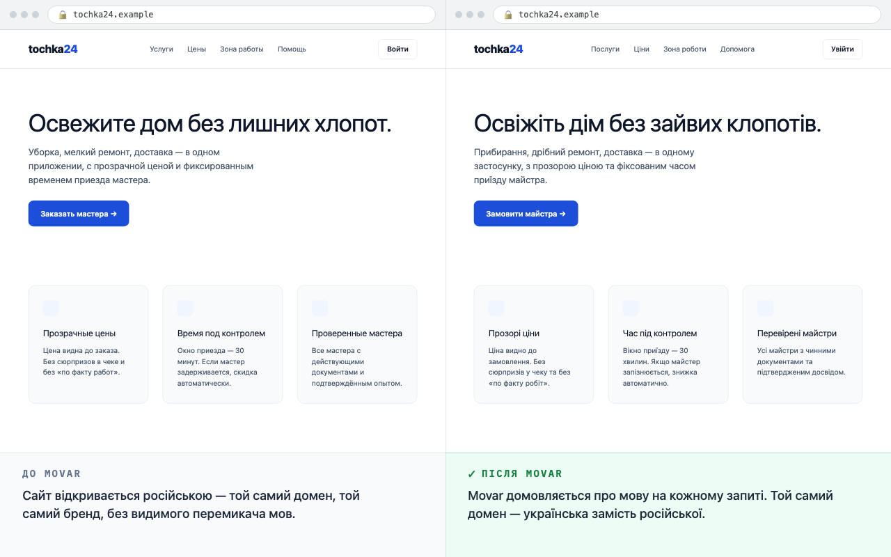
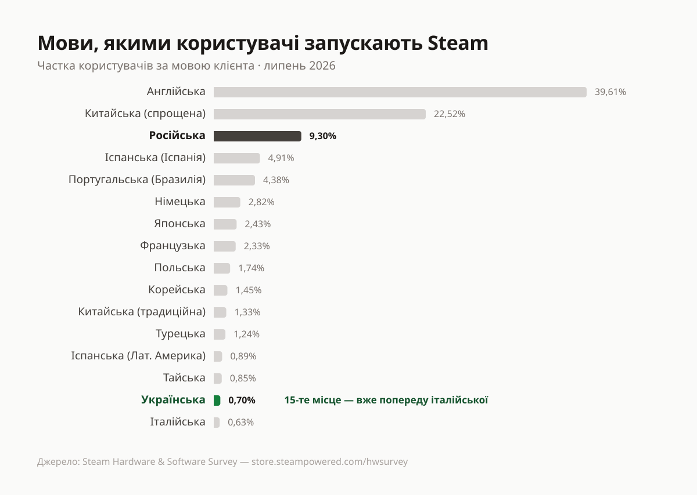
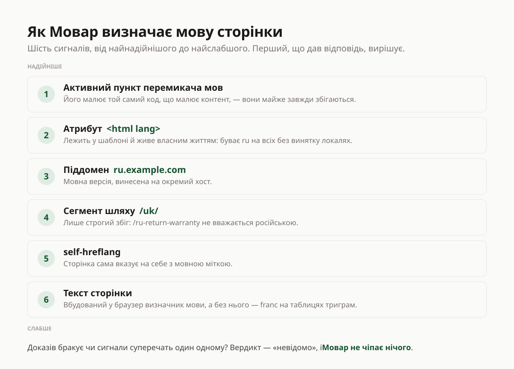
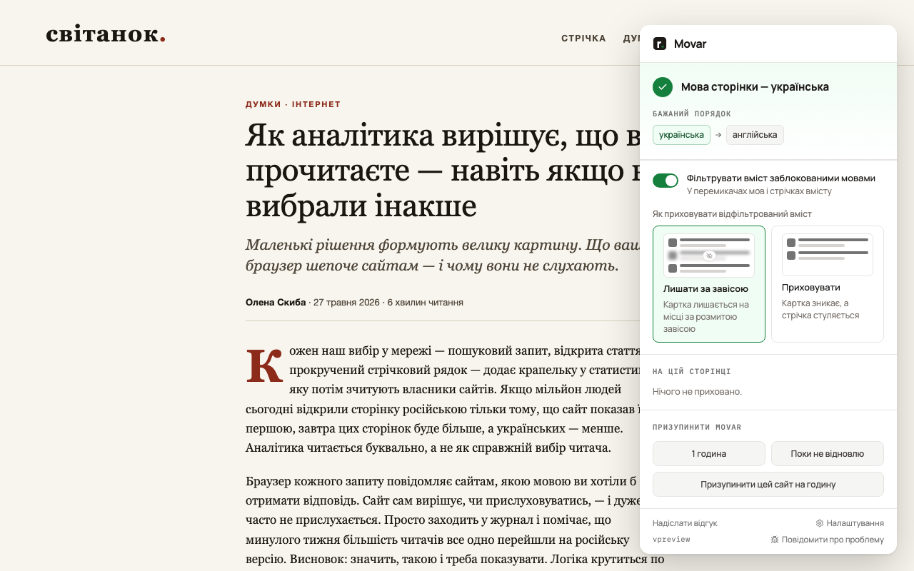

Я видалив російську всюди, де її можна видалити. У системних налаштуваннях,
розкладках клавіатур, налаштуваннях програм, переліку мов, з яких не потрібно
перекладати, у Google — а там мова інтерфейсу, мова пошуку й мова Gmail
налаштовуються окремо, у різних кутках налаштувань — усюди українська, потім
англійська. Навіть перевіряв, як браузер надсилає заголовок `Accept-Language`, і
що лежить у куках самих сайтів — чи не збереглася там колись обрана російська.
Скрізь те саме: українська, потім англійська. З мого боку російської не лишилося
ані сліду.

Але сайти та пошук вперто спілкуються зі мною російською. Я використав усі
способи заявити, якою мовою хочу отримувати контент, але інтернет ігнорує мій
вибір. А іноді ще гірше: російськомовний контент просто видають за український.

Майже кожен візит на сайт починається з пошуку перемикача на українську. Але
досить одного некоректного посилання, редиректу чи переходу на піддомен — і сайт
знову російською. Перемикаю. Ще раз. І десь на тисячний раз стає простіше
пробігтися очима по російськомовній сторінці, ніж вкотре шукати той перемикач.

Це і є тиха капітуляція. Усвідомлення того, що відступаєш від власної мови, —
гнітило найбільше.

Інтернет вперто навʼязує контент російською. Але на кожну дію має бути протидія.

Так народився Мовар — розширення для браузера з відкритим кодом. Цей проєкт має
лише одну мету: змусити інтернет спілкуватися з вами рідною мовою.

_Той самий домен, без жодного кліку по перемикачу: ліворуч сайт відкрився
російською, праворуч — Мовар домовився про мову ще на етапі запиту._

## Чому так стається

Немає однієї причини — це набір чинників і механізмів, які в підсумку дають
простий результат: контент не тією мовою, яку я обрав.

**Мова браузера — лише підказка.** Браузер надсилає заголовок `Accept-Language`
з кожним запитом — це прохання, а не команда. Багато серверів на нього взагалі не
дивляться. Що з ним робити — вирішує розробник конкретного сайту.

**Geo-IP.** Іноді для мови за замовчуванням враховується регіон, з якого йде
запит: більшість людей із вашого регіону шукають російською — отже, статистично й
ви шукаєте російською.

**Кешування.** Сторінка не тією мовою живе в кеші й не оновлюється.

**Задекларована мова й справжня — різні речі.** Заголовок можна не лише
зігнорувати — на нього можна ще й збрехати у відповідь. Сайт віддає російський
текст, а в розмітці зазначає `<html lang="uk">` або через `hreflang`
оголошує пошуковикам, що за цією адресою — українська версія. І ось що ключове:
машинерія, яка вирішує, яку версію показати в пошуку й як її підписати,
переважно довіряє тому, що сайт про себе декларує — атрибуту `lang`, `hreflang`,
структурі URL, sitemap, — а не тому, що насправді в тексті. Ніхто не звіряє одне
з одним. Тож російська сторінка потрапляє в індекс як українська; ви фільтруєте
видачу за українською — і отримуєте російські результати з українською биркою.

**Кирилицю читають як російську.** Там, де надійного атрибута немає, мову вгадують
статистичні детектори — CLD2 і CLD3, fastText. Вони не читають сторінку; вони
обирають мову, чий тренувальний корпус має найбільше збігів за n-грамами. А
російський сегмент вебу приблизно впʼятеро більший за український — за
[даними W3Techs](https://w3techs.com/technologies/overview/content_language),
російською написано 3,4% сайтів проти 0,7% українською, — тож коли кириличний
текст неоднозначний, вибір падає на більший корпус. Самі детектори до
того ж схильні вважати ці дві мови близькими — надто на короткому вводі, де слову
«погода» бракує сигналу, щоб їх розрізнити. У пошуку ще складніше: мова інтерфейсу,
мова результатів і визначена мова запиту — три окремі осі, і всі три мають
збігтися. А ШІ-відповідь зверху пише тією мовою, якою написані її джерела, — знову
російською, бо саме таких джерел більше, і саме російською вони говорять за
замовчуванням.

**Двомовні сайти обирають за вас — і не тримають вибір.** Український сайт часто
має українську версію, просто заховану за російською. Російський варіант сидить на
кореневій адресі, український — за `/uk/` чи на піддомені; перемикач — у футері або
під значком прапора. А коли ви його таки знаходите, вибір усе одно не тримається:
кука вибору живе в межах одного піддомену й скидається на сусідньому, посилання в
меню веде на кореневу російську, а поламаний `hreflang` мовчки редиректом кидає вас
назад. Звідси й та сама мова, перемкнута вдесяте за сеанс.

**Українська — на правах додаткової.** Припустімо, ви таки дісталися української
версії. Рівною вона буває рідко — і ось тут причина вже людська. Її роблять «щоб
була», а далі підтримують за залишковим принципом, тож російське лізе точково,
звідусіль, де про переклад забули. Кнопки, службові повідомлення, помилки у формі
замовлення, підказки й сторонні віджети лишаються російськими, бо лежать не в тому
файлі, який перекладали. Вбудований у сайт чат-бот відповідає російською, хай би
якою мовою ви до нього писали. Банери та інфографіка намальовані російською:
підпис усередині картинки — це робота дизайнера, а не рядок у файлі перекладу, тож
текст локалізують, а зображення лишають як є. А сам переклад часто машинний і
невичитаний — той, де «электропитание» стає «електрохарчуванням», електричний
котел — «казаном», а «две недели» доставки — «двома неділями» замість двох тижнів.
Формально українська версія є. Насправді ви читаєте суміш — і саме вона підштовхує
повернутися на російську, де принаймні все написано людиною.

**У списку мов російської немає — а в стрічці вона є.** Окремий випадок —
маркетплейси, дошки оголошень і все, де вміст пишуть самі користувачі. Інтерфейс
там буває бездоганно українським, а в перемикачі мов російської немає навіть у
списку — обирати можна хіба між українською та англійською. Але картки товарів,
описи, характеристики й відгуки — російською, бо мову вмісту не перевіряє ніхто.
Перемикати тут нема на що. Сторінка справді українська — російські в ній лише
окремі блоки.

**І петля замикається.** Найгірше — навіть не кожен окремий збій, а цикл, у який
вони складаються. Аналітика показує власникові сайту, що «більшість читачів обрала
російську» — хоча вибір робив не читач, а замовчування самого сайту. З цього
сигналу ростуть бюджети наступного року: менша україномовна аудиторія — менше
українського контенту в замовленні — менший індекс — детектори й ранжування
нахиляються до російської ще сильніше. І цикл повторюється.

Найкраще цей цикл видно там, де цифри публічні.
[Опитування Steam](https://store.steampowered.com/hwsurvey/) показує, якою мовою
користувачі запускають клієнт: станом на липень 2026-го російська — третя мова
платформи з 9,3%, українська — 0,7% і пʼятнадцяте місце. Видавці дивляться саме в цю
таблицю, коли вирішують, які локалізації замовляти. Український гравець, у якого
клієнт стоїть російською — за звичкою або через упевненість, що української
однаково немає, — потрапляє в ті 9,3%. І наступного року аргумент «українською
майже ніхто не грає» звучить вагоміше, бо його щойно підтвердили нашими ж руками.
Втім, важіль працює і в інший бік: за останні роки українська в Steam уже обійшла
італійську (0,70% проти 0,63%) — мову, яку локалізували за замовчуванням
десятиліттями.

_Мовна статистика Steam за липень 2026 року — саме та таблиця, на яку дивляться
видавці, вирішуючи, які локалізації замовляти._

## Як Мовар визначає мову

Досі я казав «Мовар бачить, що сторінка російською», ніби це очевидно. Насправді це
найважча частина всієї роботи, і найкраще видно чому, коли сигнали суперечать один
одному. Перемикач мов показує активною «UA». Атрибут `<html lang>` каже `ru`. А
класифікатор, подивившись на сам текст, повертає третє. Хто має рацію?

Мовар розвʼязує це не голосуванням, а зважуванням доказів — від найнадійнішого
сигналу до найслабшого. Перший — активний пункт перемикача мов, і саме він
важливіший за атрибут `<html lang>`, хоча інтуїція підказує навпаки. Причина
проста: перемикач малює той самий код, що малює й контент, — вони розробляються
разом і майже завжди збігаються. А `<html lang>` лежить у шаблоні й живе власним
життям: є сайти, що віддають `lang="ru"` на всіх без винятку локалях. Далі —
піддомен `ru.example.com`, потім сегмент шляху зі строгим збігом, щоб
`/ru-return-warranty` не спрацював на `ru`, і насамкінець self-hreflang, коли
сторінка сама вказує на себе з мовною міткою.

Коли всі пʼять сигналів мовчать, лишається сам текст сторінки. Тут Мовар пробує
вбудований у браузер
[визначник мови](https://developer.chrome.com/docs/ai/language-detection) —
Chrome та Edge мають його з коробки: коли він доступний, то точніший, а коли його
немає — працює `franc` на локальних таблицях триграм. Це шостий і останній крок
для вердикту всієї сторінки.

_Драбина сигналів: перший, що дав відповідь, вирішує; коли доказів бракує —
вердикт «невідомо», і Мовар нічого не чіпає._

Але вердикт для сторінки — це ще не все. Окремі елементи — картку товару, пункт
меню, заголовок результату — доводиться класифікувати поодинці, і тут не допоможе
ні ШІ, ні триграми: рядок у три слова для них замалий. Для цього є окремий
класифікатор.

Найочевидніше рішення — характерні літери: і, ї, є, ґ проти ы, ё. На абзаці працює
чудово; на короткій назві без жодної такої літери мовчить, а на цитаті — бреше.
Тому літери в Моварі — не весь метод, а лише перший щабель драбини з чотирьох.
Виграє той щабель, чий лідер першим відірвався хоча б на одиницю:

1. **Літери** — символи, характерні всередині набору кандидатів.
2. **Службові слова** — вручну відібрані граматичні маркери, найвища точність.
3. **Частотні слова** — контентні слова, згенеровані з корпусу субтитрів.
4. **`franc`** — триграмна підстраховка, і лише для тексту від 24 символів:
   коротше триграми — це вже шум, а не доказ.

Найелегантніше тут — що «характерний» означає не «унікальний у світі», а
«унікальний серед тих мов, які ми зараз розрізняємо». Літера `і` вирішує суперечку
між українською та російською, бо є лише в першій, — але між українською та
білоруською вона не визначальна, бо є в обох. І навпаки: слово `и` розрізняє
українську й російську, хоча сама літера `и` є в обох абетках.

Тому й висновок повертається не самим кодом мови, а разом із доказами: який щабель
спрацював, з яким відривом і чи взагалі було з чого обирати — чи, може, кандидат
був єдиним у своєму письмі й «переміг» без боротьби.

Окремий випадок — коли сама картка несе мовну мітку. Google, наприклад, підписує
власним атрибутом блок ШІ-відповіді. Тоді Мовар не обирає між міткою й текстом, а
зважує їх разом: мітка вирішує, коли тексту мало або його ще немає — скажімо,
відповідь ШІ ще не дописалася, — але впевнене читання тексту мітку перебиває.
Тобто картка, підписана українською, а насправді російська, за своєю биркою не
сховається: щойно в тексті зʼявляються характерні літери, вирок виносять вони. Це
рівно та розбіжність між задекларованим і справжнім, з якої починалася стаття, —
тільки полагоджена на рівні окремого блоку.

А головне — буває вирок «невідомо». Коли доказів бракує або голоси розділилися,
класифікатор не вгадує. Для Мовара «невідомо» означає «не чіпати».

Ця частина зрештою переросла сам Мовар. Класифікатор, профілі мов і коди винесені
в окремий пакет [`langtell`](https://www.npmjs.com/package/langtell), опублікований
на npm: він відповідає не на питання «якою мовою цей текст», як franc чи cld3, а на
питання «якою мовою цей заголовок, з огляду на сторінку й заголовки, з якими він
приїхав» — і показує, з чого склався висновок. Кириличний набір там ширший, ніж
потрібно Мовару (є ще сербська, македонська, казахська), тож будь-хто може взяти
його під власну пару мов. У Мовара лишилося те, що специфічне саме для нього:
швидка евристика для основного шляху, оркестратор рушіїв і нормалізація BCP-47.

І все це — на пристрої. Жодного запиту назовні, жодної телеметрії. Це не побічний
ефект, а умова.

## Принципи

За всіма цими рішеннями стоять правила, які я намагаюся не порушувати навіть тоді,
коли порушити зручно.

**Спершу перемкнути, приховати — в останню чергу.** Мовар не блокувальник. Головна
його робота — знайти українську версію, яка вже існує, і перемкнути сайт на неї.

**Через спільні механізми, а не через список сайтів.** Заголовок, `hreflang`,
розмітка, перемикач мов — це те, що є всюди, тож базовий рівень працює й на сайті,
якого ми ніколи не бачили, без жодного рядка, написаного під нього. Для окремих
сайтів — Google, YouTube — є власні моделі сторінки, які розширюють можливості там,
де спільних сигналів не вистачає. Але це надбудова, а не фундамент.

**Критерій — мова, а не зміст.** Мовар не оцінює тексти й не вішає ярликів.

**Краще не приховати російське, ніж помилково приховати українське.** Весь механізм
визначення базується на доказах, а висновок «не впевнений» означає «не чіпати».

**Явний вибір користувача сильніший за налаштування.** Якщо ви самі клікнули на
сайті «російська», Мовар не перекидає вас назад — він відступає на цьому сайті до
кінця сеансу (щонайбільше на добу). Інакше розширення скасовувало б ваш власний
вибір.

**Не фільтруємо контент за замовчуванням.** Приховування вмісту вимкнене, доки ви
самі не ввімкнете його в налаштуваннях.

**Уся обробка — на пристрої.** Включно з ШІ: коли браузер дає вбудований визначник
мови, Мовар користується ним локально.

**Опортуністично, а не обовʼязково.** Є вбудований визначник — беремо. Немає —
працюємо на локальних алгоритмах. Ніколи не завантажуємо ШІ-моделі й не вимагаємо
новішого браузера.

**Не заглядаємо в медіа.** Мовар не читає текст усередині зображень, відео чи
звуку. Це водночас принцип і обмеження.

**Жодної аналітики.** Ні лічильників, ні телеметрії, ні «анонімної статистики».

**Обіцянки перевіряє алгоритм.** Кожна з них звіряється з кодом на кожній збірці:
скажімо, «нічого не покидає браузер» — це перевірка, яка сканує джерела на мережеві
виклики й блокує збірку, якщо знайде. Не маркетинг, а тест.

**Не перекладати.** Ніколи, навіть опційно. Наступний розділ — саме про це.

## Чому Мовар не перекладає

Найочевидніша реакція на «текст не тією мовою» — перекласти його. Машинний переклад
під рукою, браузери вже мають вбудовані перекладачі, і доволі непогані. Мовар цього
не робить принципово, і це, мабуть, найважливіше рішення в усьому продукті.

Що він робить із російським вмістом, який таки лишився на сторінці? Не перекладає —
і не ховає сторінку цілком. Він прибирає окремі елементи, рівно ті, що заблокованою
мовою: варіант «російська» зі списку в перемикачі мов — на будь-якому сайті, де
такий перемикач є; результат у видачі Google, який насправді російський, хоч і
підписаний українською; картку відео на YouTube. Решта сторінки лишається як є.
Саме тому фільтр працює поелементно, а не за одним вердиктом для всієї сторінки:
сторінка буває чесно українською — а російськими в ній лише кілька карток, і
перемикати там нічого. Ви можете ввімкнути це в налаштуваннях і обрати, що робити з
відфільтрованим вмістом: приховати чи лишити за завісою.

_Фільтр вмісту — свідомий вибір: вмикається вручну, а відфільтроване або зникає,
або лишається на місці за розмитою завісою._

Чому не переклад, попри те, що технічно це найпростіше? Причин дві, і жодна з них
не другорядна.

**Переклад відмиває джерело.** Машинна українська читається як питомий текст, і ви
знову опиняєтесь наодинці рівно з тим вмістом, від якого відгородились, — тепер
мовою, якій довіряєте, з пропагандою включно. Сигнал «це російське» і є те, заради
чого Мовар встановлюють; переклад цей сигнал приховує. Чесних варіантів, коли
українського контенту немає, рівно два: показати як є — або приховати.

**Переклад гальмує розвиток української.** Україномовної аудиторії не видно тим,
хто створює контент, — вона розчиняється в російськомовній статистиці. Переклад це
лише закріплює: читач задоволений, а автор так і не дізнається, що його аудиторія
українською читає охочіше. Попит лишається невидимим, і українського контенту не
стає більше.

І тут варто сказати прямо, бо це найчастіше непорозуміння. Мовар не ділить авторів
на правильних і неправильних, і не претендує на те, щоб оцінювати зміст.
Пропаганда чудово маскується й під українську — сама лише мова не гарантує нічого
про якість тексту. Мовар робить рівно те, що заявлено: налаштовує інтернет на вашу
мову й змушує сайти поважати вибір, який ви вже зробили. Так, під фільтр потрапляє
й проукраїнський автор, який пише російською — бо критерій тут мова, а не
лояльність. Будь-який інший критерій перетворив би мовний інструмент на щось
зовсім інше. А якщо на конкретному сайті це заважає — його там можна вимкнути, на
годину або назавжди.

## Чого Мовар не може

Було б нечесно вдавати, що розширення лагодить усе. Мовар виправляє те, що
відбувається у вашому браузері: запит, який надсилається, адресу, яку ви
відкриваєте, параметри пошуку, перемикач, який він уже знає для сайту, — і прибирає
окремі елементи, що лишились російськими попри бирку. Він не править закешовані
відповіді CDN, не перетеговує неправильно класифіковані статті Вікіпедії, не
перекладе текст, вкарбований у зображення, і не змусить ШІ відповісти українською.

Поелементний фільтр теж має чітку межу. Щоб прибрати картку, Мовар має розуміти
структуру сторінки, а зараз він знає видачу Google і YouTube. Той самий маркетплейс
із попереднього розділу — де в перемикачі російської немає, а в каталозі вона є —
поки лишається неприкритим: перемикач Мовар там почистить, а картки товарів
залишаться. Кожна нова структура — це окреме правило, і це чесна відповідь на
питання «а мій сайт?».

Є й місця, де доводиться зупинятися на півдорозі. У YouTube немає аналога
google-івського `lr` — жодного параметра, який справді відсіює російськомовні
відео; `hl` і `gl` лише підштовхують інтерфейс, ранжування й рекомендації. Тож
адреса там нічого не гарантує, і єдине, що прибирає російські картки, — той самий
поелементний фільтр, який ви вмикаєте вручну. А коли фільтр Google за українською
дає порожню сторінку, Мовар один раз перезапитує без нього: наполягати на мові до
кінця означало б показати вам нуль результатів замість тих, що таки є, — після чого
ви б це розширення просто вимкнули.

Але чіткий сигнал — це передумова для всього іншого. Поки системи бачитимуть
«брудний» сигнал, детектори, ранжування та ШІ-відповіді будуть орієнтовані на
некоректну мову. Повернути собі свою мову сьогодні — це отримати більше українських
джерел зараз і більше підтримки української завтра.

## Сподобалась ідея? Долучайтеся

Мовар — некомерційний проєкт. Немає ні платної версії, ні преміум-функцій, ні даних
на продаж, і монетизувати його я не збираюся. Мета одна — щоб української в
інтернеті ставало більше. Тож якщо ідея вам близька, ось що справді допомагає:

- **Відгук у магазині розширень.** Chrome Web Store, AMO та App Store вирішують,
  кому показувати розширення, саме за оцінками й відгуками. Один чесний відгук
  важить більше, ніж здається.
- **Розкажіть знайомим.** Кожен, хто вмикає Мовар, — це ще один чистий сигнал у тій
  самій статистиці, з якої ростуть бюджети на локалізацію. Той самий цикл, що на
  початку статті, тільки вже в інший бік.
- **Повідомлення про помилки.** Сайт, де Мовар не спрацював — або спрацював там,
  де не мав, — найцінніше, що можна надіслати. Кожен такий випадок стає тестом і
  більше не повторюється.
- **Дизайн.** Це те, чого бракує найбільше: іконки, ілюстрації, матеріали для
  сторінок у магазинах. Якщо ви дизайнер і вам близька ідея — напишіть.
- **Зірочка на GitHub.** Найдешевша дія з усіх: що помітніший проєкт, то більше
  людей його знайде.

Мовар працює у Chrome, Firefox, Edge, Opera, Brave і Safari (зокрема на iOS).
[Встановити Мовар](/uk/install), а прочитати повний розбір усіх цих механізмів —
на сторінці [«Чому так стається»](/uk/why-this-happens); код — на
[GitHub](https://github.com/rejifald/movar).

А якщо вам у власному проєкті треба визначати мову — сторінки, заголовка, назви
товару, короткого рядка з користувацького вводу — спробуйте
[`langtell`](https://www.npmjs.com/package/langtell). Він народився в цьому проєкті,
але виріс в окремий пакет. Він дивиться не лише на сам текст, а й на
`<html lang>`, `og:locale` та заголовок `Content-Language`, зважує ці докази й
повертає вердикт разом із переліком того, що на нього вплинуло, — тож завжди видно,
чому рядок класифіковано саме так. Нуль обовʼязкових залежностей, MIT, `franc`
підключається окремо й лише якщо потрібен.

Мовар, `langtell` і решта моїх проєктів живуть на
[GitHub](https://github.com/rejifald) — підпишіться на профіль, щоб бачити
оновлення й нові релізи.

Налаштуйте інтернет на рідну мову.

## Джерела

- **Мови вебу** —
  [W3Techs](https://w3techs.com/technologies/overview/content_language). Оцінка
  за вибіркою, а не перепис: дає порядок величин, не точні частки.
- **Мови клієнтів Steam** —
  [опитування обладнання та ПЗ](https://store.steampowered.com/hwsurvey/),
  оновлюється щомісяця.
- **Вбудований визначник мови в браузері** —
  [документація Chrome](https://developer.chrome.com/docs/ai/language-detection).
  Мовар використовує його там, де він є, і власні алгоритми там, де немає.
- **Визначник, винесений в окремий пакет** —
  [`langtell`](https://www.npmjs.com/package/langtell). Народився в цьому
  проєкті, опублікований окремо — його можна прочитати й перевірити незалежно
  від Мовара.
- **Код самого Мовара** —
  [github.com/rejifald/movar](https://github.com/rejifald/movar). Кожне
  твердження цієї статті про те, що робить розширення, перевіряється там.
